#+begin_right
/Wherein feature engineering is rescued from the wilds of
semi-empiricism and restored to the bosom of pure mathematics. A summary, additional context, and bonus nonsense for [[[DisRep]]]./ 
#+end_right
* Introduction
-----
- I'll be reviewing Higgins, et al. [[[DisRep]]], a neat paper from 2018 which makes connections
  between deep learning and group actions. The HSP generalizes to
  finding stabilizers, so this may be a good place to
  look for applications.
- Since the formalism in both cases is very simple, I'll start with some
  broader context, trying to get at a basic question: what the heck should
  we learn?
* Representation learning
-----
- Bengio et al.'s review of representation learning [[[RepLer]]] is
  one of the most cited papers in machine learning. It
  defines representation learning, its philosophy and goals, and some
  concrete model-building heuristics, including "generic" priors
  which, it is hoped, lead to "good" representations. One of these
  generic priors is that the representation should /disentangle
  factors of variation/. I'll talk about this shortly
- We can think of a representation, broadly
  speaking, as some way of pre-processing raw data ($X$ below) into a new feature space (denoted $F$) to help train a
  model (perhaps involving supervised learning with an output space $Y$). Put differently, we would
  like to perform /unsupervised feature learning/ on the raw data, and
  use these features downstream. We want to automate feature engineering!
#+ATTR_HTML: :alt cat/spider image :align center :width 230px :style display:inline;margin:-20px;
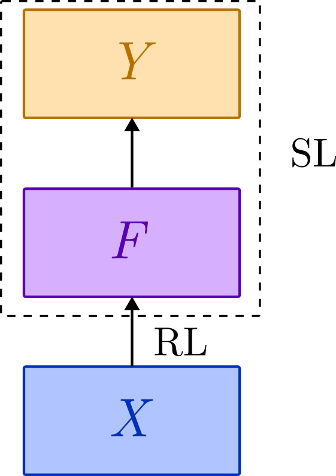
** Generic priors
- What are some good ways to approach this? Well, it's hard to say a
  priori. We have no alternative but to go out into the world and
  gather some "semi-empirical" observations about natural
  data-generating processes! We then use these to inform generic,
  task-independent meta-heuristics about what sort of
  structures are useful. It's some kind of meta-learning
  process!
- Here are some of the priors suggested by Bengio and friends:
  - *Smoothness.* The functions we learn are smoothly approximable. Or, to paraphrase
    Carl Bender, /the functions are not out to get us/. Nature is lazy
    and smoothness is easier!
    #+ATTR_HTML: :alt cat/spider image :align center :width 160px :style display:inline;margin:-30px;
    
  - *Distribution.* There are multiple factors, that
    can be independently varied. The model is
    "hinged".
    #+ATTR_HTML: :alt cat/spider image :align center :width 160px :style display:inline;margin:-30px;
    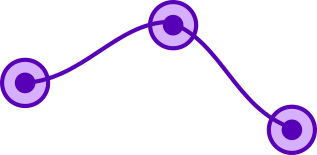
  - *Hierarchy.* Explanatory factors have a global hierarchy. This
    presumably underlies the success of deep learning!
    #+ATTR_HTML: :alt cat/spider image :align center :width 220px :style display:inline;margin:-20px;
    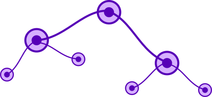
  - *Simplicity.* Although there is a global hierarchy, local
    relations in the hierarchy are simple, e.g. linear.
    #+ATTR_HTML: :alt cat/spider image :align center :width 220px :style display:inline;margin:-20px;
    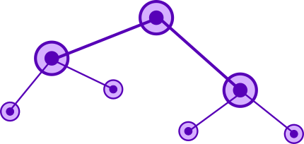
  - *Sparsity.* For a given observation, only a small number of
    factors is relevant.
    #+ATTR_HTML: :alt cat/spider image :align center :width 220px :style display:inline;margin:-20px;
    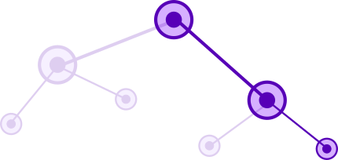
  - *Manifolds.* Distributions tend to concentrate on low-dimensional
    submanifolds of the original data space. Different values of
    categorical variables lie on different submanifolds, with low
    measure overlaps.
    #+ATTR_HTML: :alt cat/spider image :align center :width 250px :style display:inline;margin:-10px;
    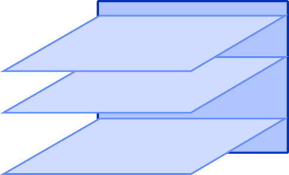
  - *Coherence.* (Temporally) consecutive or (spatially) adjacent
    observations tend to vary slowly on the appropriate categorical
    submanifold.
    #+ATTR_HTML: :alt cat/spider image :align center :width 250px :style display:inline;margin:-10px;
    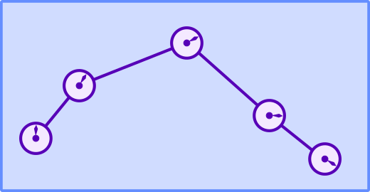
  - *Semi-supervision.* Representations that help to explain the (unsupervised) input
    distribution, $p(x)$, tend to be useful for learning a
    (supervised) output distribution $p(y|x)$ or associated task,
    e.g. transfer learning. Simply put, features share structure with
    outputs.
    #+ATTR_HTML: :alt cat/spider image :align center :width 280px :style display:inline;margin:-10px;
    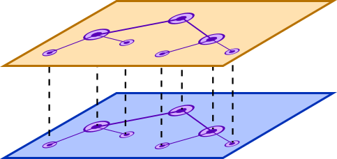
** The curse of dimensionality
- These assumptions can basically be divided into a local
  regularity conditions (smoothness, simplicity, coherence) and global
  structure (distribution, hierarchy, sparsity, semi-supervision). The
  manifold condition is both, since it tells us it tells us embeddings
  are locally smooth, but globally high codimension and approximately
  disjoint for different values of a categorical variable.
- Global assumptions show their worth when we consider the /curse of
  dimensionality/.
  Some learning methods are based only on smoothness. We pick a nice
  family of target functions, and our
  job is to use "examples to explicitly map out the wrinkles". We
  collect local bumps via training and smoothly interpolate between them.
  #+ATTR_HTML: :alt cat/spider image :align center :width 260px :style display:inline;margin:-10px;
  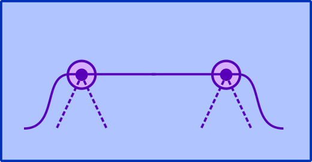
- The problem with this type of /local generalization/ is that,
  if we work in the raw input space $X$, the number of possible bumps
  can grow exponentially with the dimension of the data. For instance, for
  $n$ binary categorical features, if we work at the level of raw
  strings we have an exponentially large hypercube of bumps to map out. Snaking around it linearly will require $O(2^n)$ features.
  #+ATTR_HTML: :alt cat/spider image :align center :width 260px :style display:inline;margin:-10px;
  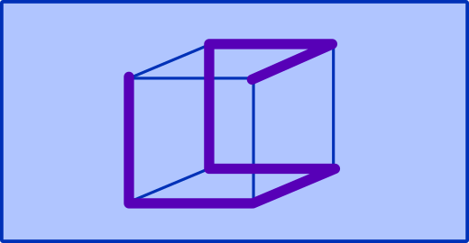
- The same lesson applies to kernel methods, where we
  usually pick a kernel a priori (equivalent to a local smoothness
  assumption) and then train it by solving some optimization problem
  to interpolate between examples. Indeed, kernel methods, traditional
  clustering algorithms, Gaussian mixtures, nearest neighbours, etc,
  are all a form of /one-hot encoding/, a maximally sparse
  representation with a totally flat/local feature hierarchy. As a
  binary representation, it places a single $1$ at the
  bump location, and $0$ elsewhere.
  #+ATTR_HTML: :alt cat/spider image :align center :width 450px :style display:inline;margin:-10px;
  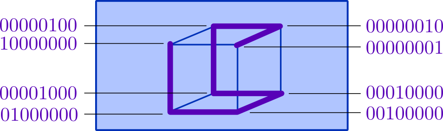
- Clearly, this description of the cube can be
  compressed at the cost of some sparseness. If we learn the
  /dimensions/ of the hypercube instead of traversing the vertices, we
  need only $O(n)$ features. This is expressive and distributed in the
  sense given above. If we would like to sparsify our features, we can
  learn lower-dimensional features, e.g. faces or
  edges. Separate subcubes are one-hot indexed, but within the subcube
  we use binary.
  #+ATTR_HTML: :alt cat/spider image :align center :width 260px :style display:inline;margin:-10px;
  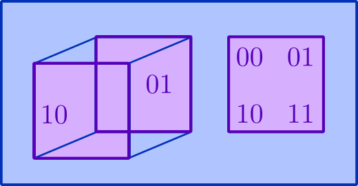
- That said, local generalization methods aren't useless. They
  are maximally sparse, analytically tractable, and have other
  nice properties.
  In fact, we can combine them with representation learning!
  An important example is kernel methods, where instead of picking a
  kernel a priori, we /learn the kernel/, i.e. use the learned
  representation $F$ as the feature space, and then perform our
  supervised learning task. This is an example of semi-supervision.
#+ATTR_HTML: :alt cat/spider image :align center :width 230px :style display:inline;margin:-20px;

** Invariance and disentanglement
- It would be nice to take these high-level intuitions and make them formal. A
  good place to start is the notion of /invariance/. The idea is that,
  if we have a hierarchical representation, abstract features at a
  high level should be invariant to perturbations lower down. A cat is
  still a cat even if it's missing some whiskers.
  #+ATTR_HTML: :alt cat/spider image :align center :width 280px :style display:inline;margin:-10px;
  
- We can imagine categorical submanifolds as splitting into
  lower-dimensional sections. Perturbations may bump us off that
  section, but not out of the ambient categorical manifold. A
  cat without whiskers is not a dog.
  #+ATTR_HTML: :alt cat/spider image :align center :width 300px :style display:inline;margin:-10px;
  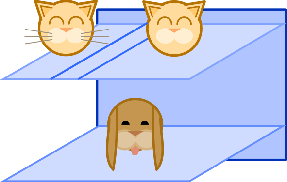
- More generally, /invariant features/ are features with "reduced
  sensitivity in the direction of invariance", for instance, along a
  categorical manifold (blue directions) rather than away from it (red
  direction).
  #+ATTR_HTML: :alt cat/spider image :align center :width 300px :style display:inline;margin:-10px;
  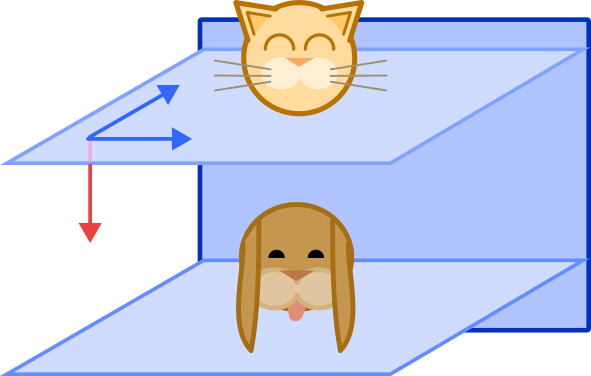
- I'm leaning a bit heavily on intuitions about categorical manifolds;
  just imagine that instead of separate submanifolds, we have level
  sets of a continuous function. It's a limit of the categorical case.
  #+ATTR_HTML: :alt cat/spider image :align center :width 280px :style display:inline;margin:-10px;
  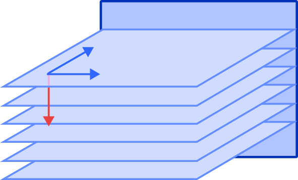
- The other thing I haven't explained is "sensitivity". This is a
  task-specific notion, so that "invariant" really means "doesn't
  affect models trained to do X". Whiskers might not affect the task
  of distinguishing cats and dogs, but they do affect the task of
  distinguishing pets with and without supplementary facial hair.
  #+ATTR_HTML: :alt cat/spider image :align center :width 230px :style display:inline;margin:-10px;
  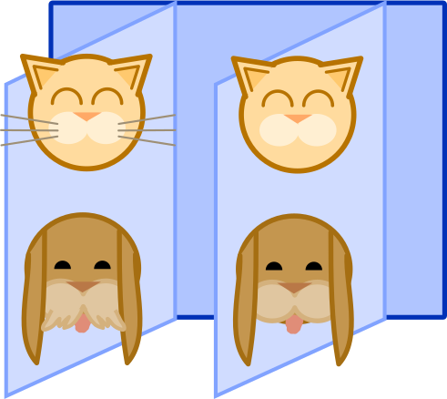
- If invariance is task-dependent, how can we learn invariant features
  without supervision? We can't! Instead, we have to get a
  handle on the distribution from the data itself, i.e. using
  /variation/. We may not know about cats and dogs, but we might see
  these submanifold-approximate clusters, or gradients in the smoothed
  density of data points which are flat in some directions and not
  others.
  It's then natural to seek features which correspond to, and separate, factors of variation. This
  is called a /disentangled representation/.
  #+ATTR_HTML: :alt cat/spider image :align center :width 310px :style display:inline;margin:-10px;
  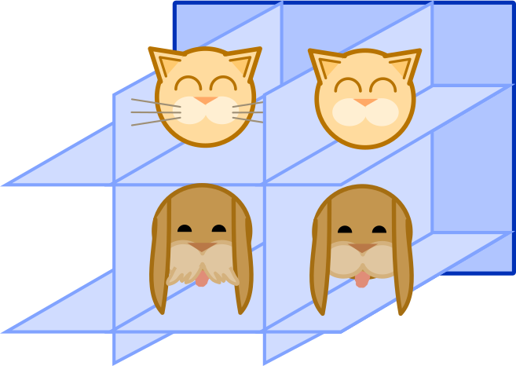
- Before moving on, note that this is a bit like PCA, which looks for factors of variation
  (directions of variance) and separates them (directions are
  orthogonal). For representation learning we don't expect to have a
  global linear structure. We will need something like "local
  PCA". I'll return to this below.
  #+ATTR_HTML: :alt cat/spider image :align center :width 200px :style display:inline;margin:-10px;
  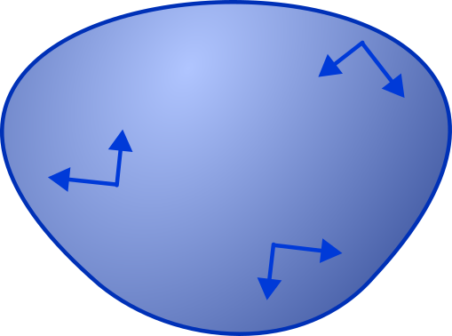
* Disentangled representations
-----
- However, instead of geometry, we're going to go down the path of algebra!
  The basic, clever observation is that disentangled representations
  are a special case of invariance, since factors
  should be /invariant with respect to changes of the other
  factors/. They are invariant features of the distribution
  itself.
- The word "invariant" should immediately conjure other words like
  "symmetry" and "group", namely the transformations our data is
  invariant to. The goal of [[[DisRep]]] is to formalize the notion of a
  disentangled representation using groups.
** Group actions
- To start off, recall that a group $G$ /acts on/ a set $X$ when
  element $a \in G$ is a permutation (i.e. bijection) $\varphi_a: X \to X$
  such that the permutation of a product $ab$ is the product of permutations:
  \[
  \varphi_{ab} = \varphi_a \circ \varphi_{b}.
  \]
  This is a homomorphism $\varphi: G \to S_X$, where
  $S_X$ is the group of permutations of $X$ under composition.
  Visually, $\varphi$ maps a "multiplication triangle" in $G$ to a
  "composition triangle" in $X$ (or $S_X$).
#+ATTR_HTML: :alt cat/spider image :align center :width 370px :style display:inline;margin:-20px;
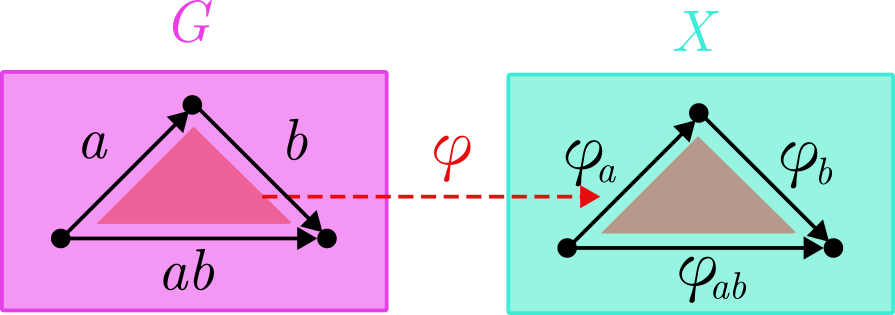
- We also need to take products of groups. If $G = G_1 \times G_2
  \times \cdots \times G_n$, we turn $G$ into a group by multiplying
  "vectors" of group elements coordinate-wise:
  \[
  (a_1, a_2, \ldots, a_n) \cdot (b_1, b_2, \ldots, b_n) = (a_1\cdot
  b_1, \ldots, a_n \cdot b_n),
  \]
  for $(a_1, \ldots, a_n), (b_1, \ldots, b_n) \in G$. Visually, a
  multiplication triangle of vectors splits into a vector of
  triangles.
#+ATTR_HTML: :alt cat/spider image :align center :width 500px :style display:inline;margin:-20px;
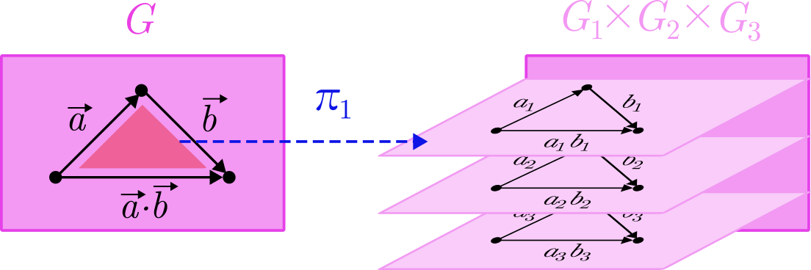
- We can also define a /projection map/ $\pi_i: G \to
  G_i$. This mapping of triangles means $\pi$ commutes with
  multiplication, in the sense that
  \[
  \pi(\vec{a} \cdot \vec{b}) = \pi(\vec{a}) \cdot \pi(\vec{b}).
  \]
  We can either perform multiplication then project, or project and
  then multiply.
- If each factor group $G_i$ acts on a set $X_i$, then the product of
  the groups $G$ acts on the Cartesian product of the sets, $X = X_1
  \times \cdots \times X_n$. Put simply, the permutation of a vector
  is a vector of permutations:
  \[
  \varphi_{(a_1, \ldots, a_n)} = (\varphi_{a_1}, \ldots, \varphi_{a_n}).
  \]
  We'll call such a group action /disentangled/. Visually, a vector of
  mulitiplication triangles gets mapped to a vector of composition
  triangles.
#+ATTR_HTML: :alt cat/spider image :align center :width 450px :style display:inline;margin:-20px;
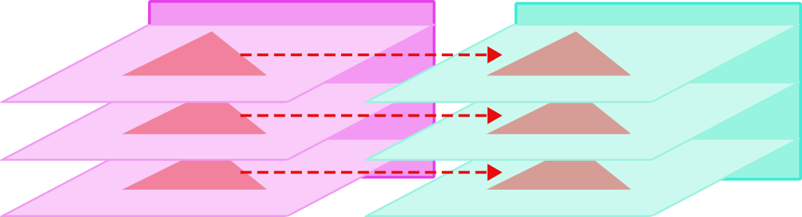
- In fact, if we want to be fancy, we can capture the factorization
  property and the group action property in one diagram. Loosely, the
  projection $\pi$ and group action $\varphi$ commute, so we we can
  draw them as a /commutative diagram/, where maps are arrows,
  domain/range are vertices, and composition is /path-independent/:
#+ATTR_HTML: :alt cat/spider image :align center :width 450px :style display:inline;margin:-20px;
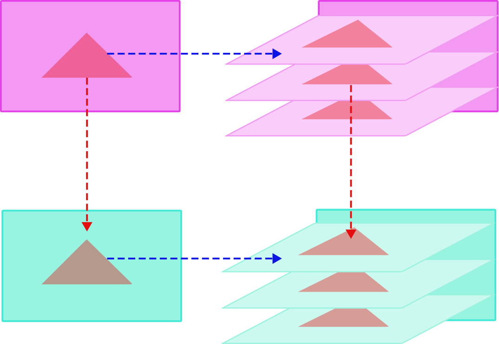
- The last notion we need is that of /equivariance/. Suppose that $G$
  acts on $X$ and $Y$. A function $f: X \to Y$ is $G$-equivariant if,
  for all $a \in G$,
  \[
  f \circ \varphi_a^{(X)} = \varphi_a^{(Y)} \circ f.
  \]
  With some mild abuse of notation, we can simply say $\varphi$ and $f$
  commute. As a commutative diagram:
#+ATTR_HTML: :alt cat/spider image :align center :width 170px :style display:inline;margin:-20px;
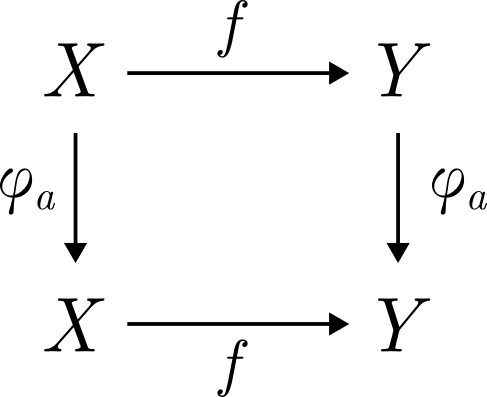
- When our set is a vector space $V$, we can choose our group action $\varphi:
  G \to \mathrm{GL}(V)$ to assign group elements to invertible
  matrices. A disentangled action is defined in a similar way, except
  that we use the direct sum notation $V = V_1 \oplus \cdots \oplus
  V_n$. In this case, the action is called a /representation/.
#+ATTR_HTML: :alt cat/spider image :align center :width 270px :style display:inline;margin:-20px;
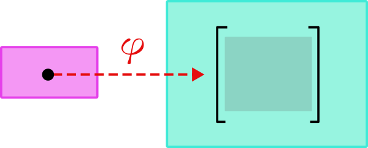
** Inheriting symmetries
- A disentangled group action is not quite enough to define a
  disentangled representation. The problem is that the group can act
  on multiple things: the world itself (underlying the data
  distribution), the data, or the features. In fact, we want our
  features to /inherit/ or learn the symmetries of the world! But it
  is constrained to go through the data.
- Let $W$ denote states of the world. Different states correspond to
  different data distributions, $p(x|w) = p_w(x)$, for a state $w \in
  W$ and datum $x \in X$. We'll also suppose that $G$ is a set of
  symmetries of $W$ that factorizes, $G = G_1 \times \cdots \times
  G_n$.
- Note that we don't require the world $W$ to be carved into neat
  factors on which $G$ acts in a disentangled way. This is an
  important point! The world is typically messy and entangled, so our
  goal is not to model the world per se, but the explanatory factors
  underlying it.
- Now, suppose we gather enough data to learn $p_w$. A representation
  maps this distribution (or equivalently, $p_w$) to a point in our
  feature space $F$.
  Let's call this representation process $\mathcal{R}: W \to F$.
- Then $\mathcal{R}$ is a /disentangled representation/ if
  - our feature space $F = F_1 \times \cdots \times F_n$ carries a
    disentangled action of $G$, and
  - it is $G$-equivariant, $\mathcal{R} \circ \varphi = \varphi \circ
    \mathcal{R}$.
#+ATTR_HTML: :alt cat/spider image :align center :width 170px :style display:inline;margin:-20px;
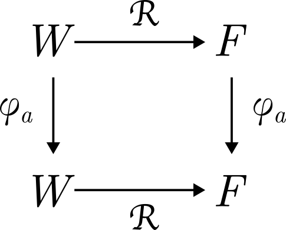
- If $F = F_1 \oplus \cdots \oplus F_n$ is a vector space, and $\varphi: G
  \to F$ is a representation, then
  $\mathcal{R}$ is a /linearly disentangled representation/ under the
  same conditions, i.e. 
  - $G$ acts in a disentangled manner on $F$,
    \[
    \varphi(a_1, \ldots, a_n) = (\varphi_1(a_1), \cdots, \varphi_n(a_n)),
    \]
    where $\varphi_i(a_i)$ is a representation of $F_i$, and
  - $\mathcal{R}$ is $G$-equivariant.
- That's it for the formal definition! To illustrate, there is a toy
  example, using a variational autoencoder on a coloured donut. It
  makes a sequence of single pixel observations, top left. These are
  used to train some latent factors $z_1, z_2, z_3$, whose traversals
  (vary one, fix others) are pictured top right. The bottom shows how
  world states get mapped to features in an equivariant way.
#+ATTR_HTML: :alt cat/spider image :align center :width 600px :style display:inline;margin:-20px;
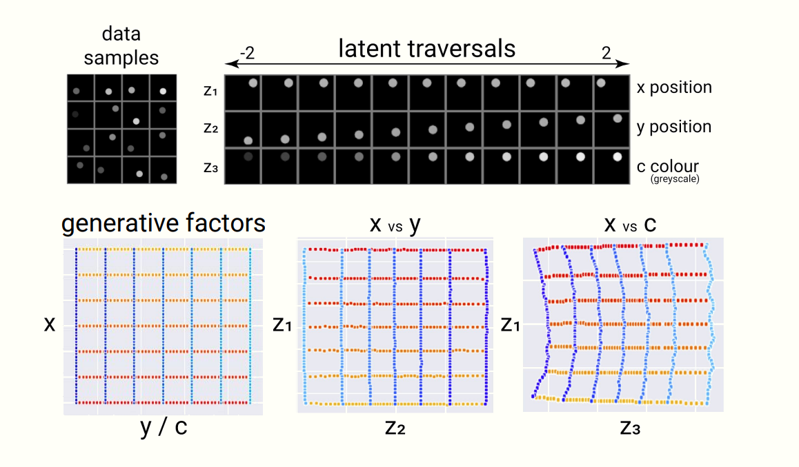
- In fact, they use a variant of the vanilla VAE called the
  $\beta$-VAE, where $\beta$ is a hyperparameter which reweights the
  KL divergence in the loss function. We can view $\beta$ from the
  information bottleneck perspective as penalizing shared information
  between factors, so higher values lead to higher disentanglement!
  It's cool, but beyound our scope. See [[[UVAE][4]]] for details.
** Quantum disentanglement
- Amusingly, this overlaps a recent quantum information paper on
  entanglement [[[MultEnt]]]; the relevant notions of "disentanglement" are
  suprisingly similar.
- Usually, entanglement is a number, for instance von Neumann entropy,
  Schmidt number, distillable entanglement, etc.
  The insight of [[[MultEnt][2]]] is that we can directly define an /entanglement
  group/ associated to the state.
  This captures the operational power of entanglement in a direct way.
- Consider a multipartite Hilbert space,
  \[
  \mathcal{H} = \mathcal{H}_1 \otimes \cdots \otimes \mathcal{H}_n.
  \]
  A state $|\psi\rangle \in \mathcal{H}$ is entangled when operations
  on one tensor factor affect another tensor factor; operations on one
  factor can therefore be /undone/ on another. This is the algebraic
  version of "spooky action at a distance".
- More formally, note that the product group
  \[
  \mathrm{U}(\mathcal{H}) = \mathrm{U}(\mathcal{H}_1)
  \]
* COMMENT Quantum stuff
- There's a fun analogy to quantum mechanics lurking here. One-hot
  encoding is a qudit, $\mathcal{H}_{2^n}$, and the compression into
  $k$-faces is
  \[
  \mathcal{H}_{2^n} = \bigoplus_{i=1}^{2^{n-k}}\mathcal{H}_2^{\otimes k}.
  \]
  This may seem trivial, but we will return to it later.
* References
-----
1. [[https://arxiv.org/pdf/1812.02230.pdf]["Towards a Definition of Disentangled Representations"]]
   (2018). Higgins, Amos, Pfau, Racaniere, Matthey, Rezende, and
   Lerchner. <<DisRep>>
2. [[https://arxiv.org/pdf/2307.06437.pdf]["Multipartite entanglement groups"]] (2023). Jiang, Kabat, Lifschytz,
   and Marthandan. <<MultEnt>>
3. [[https://arxiv.org/pdf/1206.5538.pdf]["Representation Learning: A Review and New Perspectives"]] (2014).
   Bengio, Courville and Vincent. <<RepLer>>
4. [[https://arxiv.org/pdf/1804.03599.pdf]["Understanding disentangling in β-VAE"]] (2018), Burgess, Higgins, Pal, Matthey,
   Watters, Desjardins, Lerchner. <<UVAE>>
* COMMENT html export
#+CREATOR: 
#+AUTHOR: 
#+TITLE:
#+HTML_CONTAINER: div
#+HTML_DOCTYPE: xhtml-strict
#+HTML_HEAD: <link rel="stylesheet" type="text/css" href="style.css" >  <h1><b>Dis/entangled representations</b></h1>
#+HTML_LINK_HOME:
#+HTML_LINK_UP:
#+HTML_MATHJAX:
#+INFOJS_OPT:
#+LATEX_HEADER:
#+OPTIONS: html-postamble:nil
